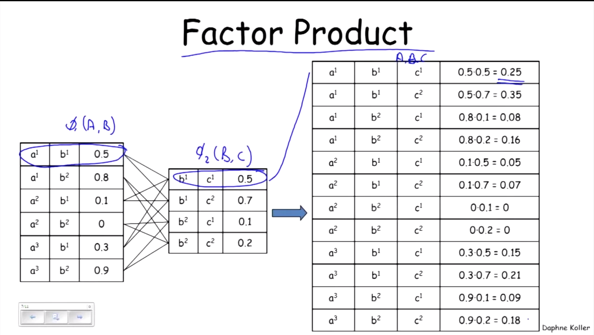
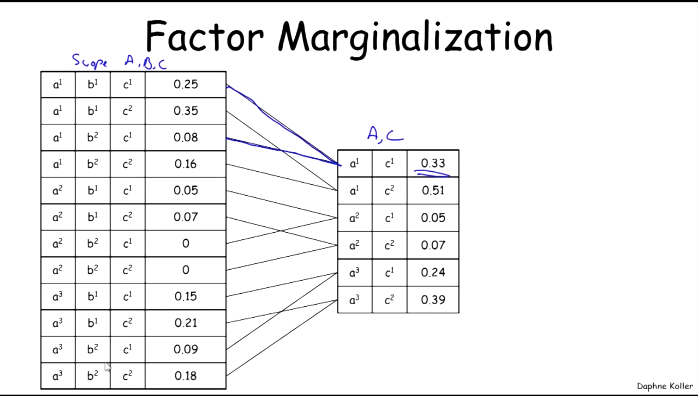

Some defintions 

<i>Joint Distributions</i>
The probability distribution that defines the simultaneous behavior of multiple random variables is the joint distribution of the thos random variables

<i>Conditioning</i>
The process of updating the probability distribution on making an observation. Helps in answering questions like, what are the chances that it will rain today given that the moisture laden winds are traveling east at 20 miles per hour 

<i>Marginalization</i>
Marginalization is an operation that takes a probability distribution over a larger subset of variables and produces a probability distribution over a subset of those

<i>Factor</i>
A factor really is a function, or a table. It takes a bunch of arguments and it gives us a value for every combination of values we provide it

<i>Factor Product</i>
Factor product is like taking a cross join and multipying

<i>Factor Marginalization</i>
Factor Marginalization is similar to taking a groupby sum

Factors are the fundamental building block in defining these distributions and high dimensional spaces. That is the way in which we're going to define an exponentially large probability distribution over N random variables is by taking a bunch of little pieces and putting them together by multiplying factors in order to define these high dimensional probability distributions. It turns out also that the same set of basic operations that we use to define the probability distributions in these high dimensional spaces are also what we use for manipulating them in order to give us a set of basic inference algorithms.

<i>Bayesian Network (BN)</i>
 
- Bayesian Network is a directed acyclic graph, G, whose nodes represent random variables X1,...,Xn. 
 
- For each node Xi, a conditional probability distribution(cpd), P(Xi|Parents(Xi))
 
- The BN represents the a joint distribution via the chain rule for Bayesian Networks

 
<i>P factorises over G</i>
 
P factorizes over G if
P(X1,X2,...,Xn) = πi(Xi|ParG(Xi))
where G is a graph over X1,...,Xn
